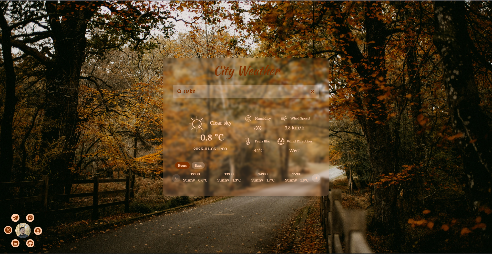

# Weather Forecast Application



A beautiful weather forecast application with city search functionality, built with React, TypeScript, and Vite. Features a glassmorphism UI design with animated autumn-themed backgrounds. You can see demo [here](https://srfie714692358.github.io/ForecastWeather/)

## Features

-   🌍 **City search** with autocomplete suggestions
-   🌤️ **Current weather display** with temperature, humidity, wind speed and direction
-   📅 **Toggleable forecasts** - switch between hourly and daily forecast
-   🍂 **Animated autumn background** slideshow
-   📊 **Visual weather indicators** with appropriate icons based on WMO weather codes

## Technologies Used

-   **Framework**: React 19 with TypeScript
-   **Build Tool**: Vite
-   **Styling**: Tailwind CSS
-   **State Management**: Zustand
-   **UI Components**: Custom components with Shadcn UI (Radix) primitives
-   **Icons**: Custom SVG weather icons
-   **Documentation**: Generated by QWen3-Max AI
-   **APIs**:
    -   Open-Meteo Geocoding API for location search
    -   Open-Meteo Weather Forecast API for weather data

## Project Structure

```
src/
├── assets/
│   ├── bg-images/                # Autumn background images
│   └── icons/                        # Weather status icons
├── components/
│   ├── ui/                             # Reusable (Shadcn) UI components (Command, Popover, etc.)
│   └── GlassyCard.tsx          # Glassmorphism-styled container component
├── features/
│   ├── background/              # Animated background slideshow
│   ├── city-search/              # City search functionality
│   │    └── hooks/                # Cities list fetch hook
│   ├── weather-detail/         # Current weather display
│   └── weather-forecast/    # Hourly/daily forecast weather
├── hooks/
│   ├── useDebounce.ts          # Input debouncing utility
│   └── useFetchWeather.ts  # Weather data fetching hook
├── lib/
│   ├── ClassUtils.ts               # Tailwind CSS class merging utility
│   ├── DateTimeUtils.ts        # Date and time formatting helpers
│   └── WeatherUtils.ts         # Weather data processing functions
├── stores/
│   └── globalStates.ts           # Zustand global state store
├── types/
│   ├── City.ts                        # City data type definitions
│   └── WeatherDetail.ts       # Weather API response types
├── apis/
│   ├── CitySearch.ts             # City search API integration
│   └── WeatherDetail.ts       # Weather forecast API integration
└── core/
      └── App.tsx                      # Main application component and manage weather data fetching (loading, error, etc.)
```

## Installation

1. Clone the repository:

```bash
git clone https://github.com/srfie714692358/ForecastWeather.git
cd ForecastWeather
```

2. Install dependencies using pnpm:

```bash
pnpm install
```

## Development

Start the development server:

```bash
pnpm dev
```

The application will be available at `http://localhost:5173`

## Building for Production

Build the application for production deployment:

```bash
pnpm build
```

The optimized production build will be generated in the `dist/` folder.

To preview the production build locally:

```bash
pnpm preview
```

## Deployment

The application is a static site that can be deployed to any static hosting service:

1. Build the application (`pnpm build`)
2. Deploy the contents of the `dist/` folder to your hosting provider

## Notes

-   The application uses public APIs and doesn't require any API keys
-   Background images are included in the repository (note: large image files will increase repository size)
-   The app is designed for desktop view (not responsive for mobile devices)

## License

This project is open source and available under the [MIT License](LICENSE.md).

---

Made with ❤️ by Elshan | [Portfolio](https://srfie714692358.github.io/srfie714692358/) | [LinkedIn](https://www.linkedin.com/in/sajjad-rafiee-tabriz)
